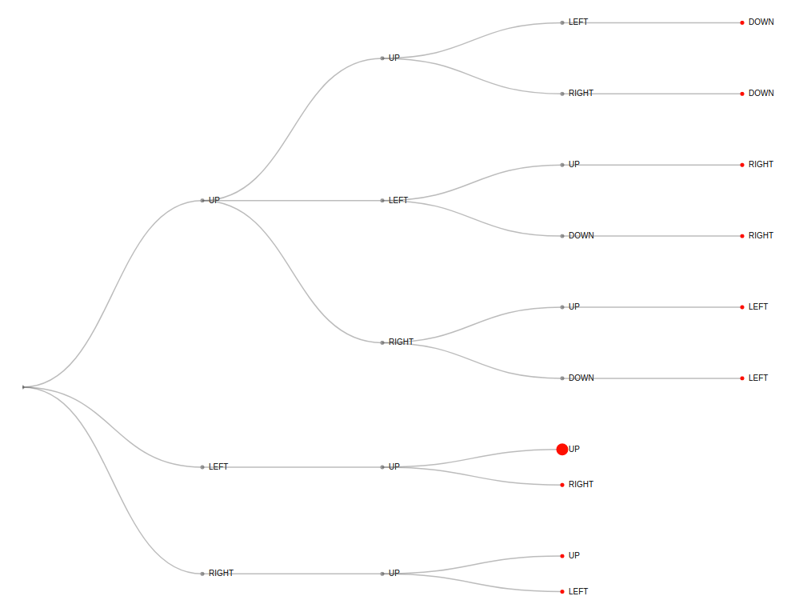

# NSquare Puzzle Solver and Visualizer
**Artificial Intelligence: A Modern Approach, 3rd Edition**

**Chapter 3** 

The NSquare puzzle solver finds the solution to a simple 3x3 n-square puzzle and displays the search tree in real time as the puzzle is being solved.

A 3x3 n-square puzzle contains 8 tiles in a 9 square grid labeled with the numbers 1-8. Tiles adjacent to the empty space can be moved into the space. The goal is to randomly move the pieces from the initial state and then attempt to get them back into the initial positions.

The search tree looks like this and is populated in real-time as the puzzle solution space is being searched:

 
## Program Goals
The goals of this program are as follows:

1. Implement a simple search algorithm that solves the puzzle.
1. To dynamically display the search tree as it is being modified by the algorithm.

I also wanted to improve my javascript and d3 skills.
 
## How to use it...
When the puzzle is displayed, either manually mix up the puzzle by clicking on the squares, or enter a number of steps and click the "Randomize" button. 

After the puzzle has been mixed up, click the "Solve" button to start the search for a solution. The right-hand side of the display will show the search tree as it is being populated. Red circles indicate the nodes that are currently in the frontier.

## How it works...
The puzzle is solved using a simple breadth-first search of the possible solution spaces. It is implemented in Javascript to facilitate the dynamic presentation of the search tree. The D3 Javascript library is used for all graphical presentation.